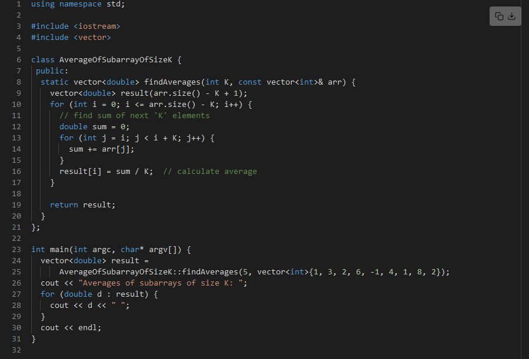
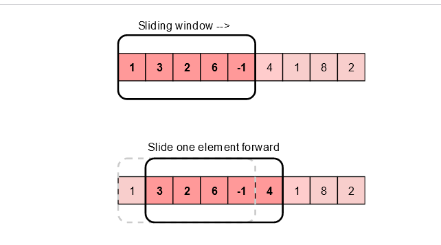
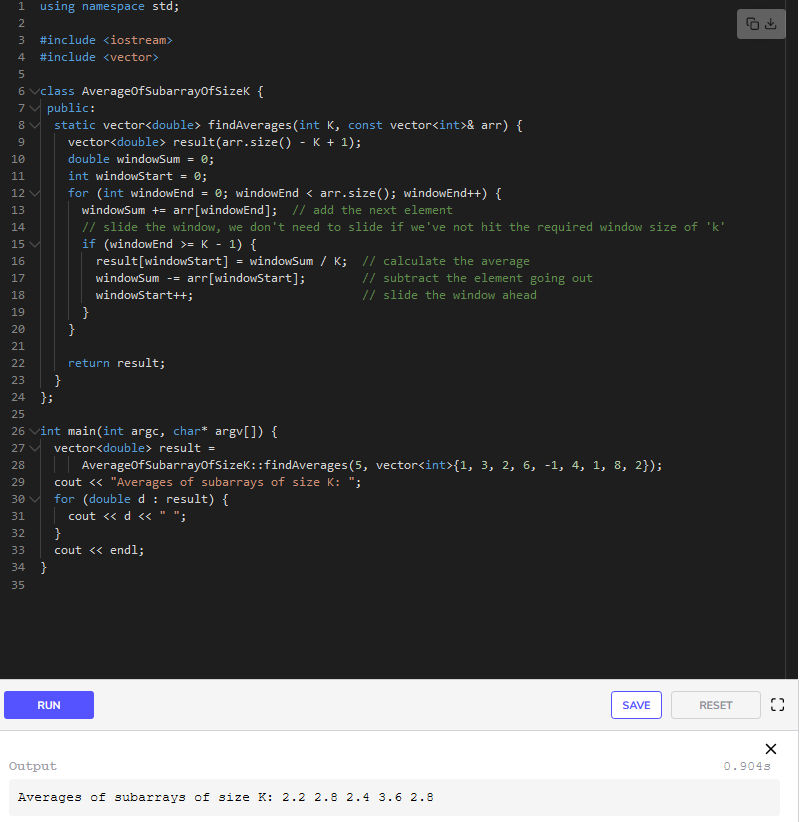

# Given an array, find the average of all contiguous subarrays of size ‘K’ in it.

## Input
Array: [1, 3, 2, 6, -1, 4, 1, 8, 2], K=5

## Output
Output: [2.2, 2.8, 2.4, 3.6, 2.8]

## Brute Force Algo

### Time complexity: 
Since for every element of the input array, we are calculating the sum of its next ‘K’ elements, the time complexity of the above algorithm will be `O(N∗K)O(N*K)O(N∗K)` where ‘N’ is the number of elements in the input array.

## Sliding Window Algo

The efficient way to solve this problem would be to visualize each contiguous subarray as a sliding window of ‘5’ elements. This means that when we move on to the next subarray, we will slide the window by one element. So, to reuse the sum from the previous subarray, we will subtract the element going out of the window and add the element now being included in the sliding window. This will save us from going through the whole subarray to find the sum and, as a result, the algorithm complexity will reduce to `O(N)O(N)O(N)`.

