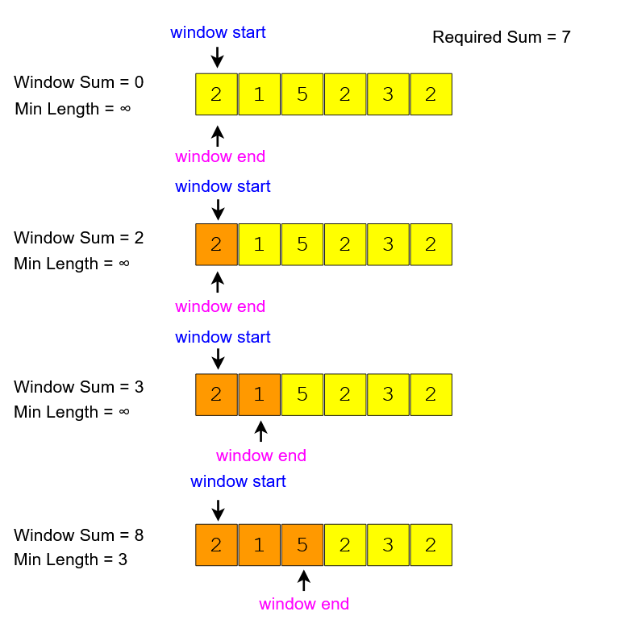
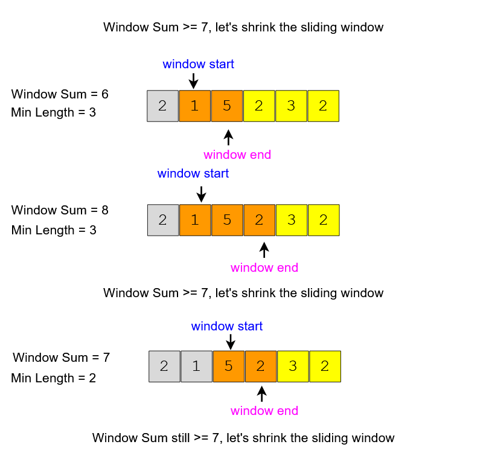
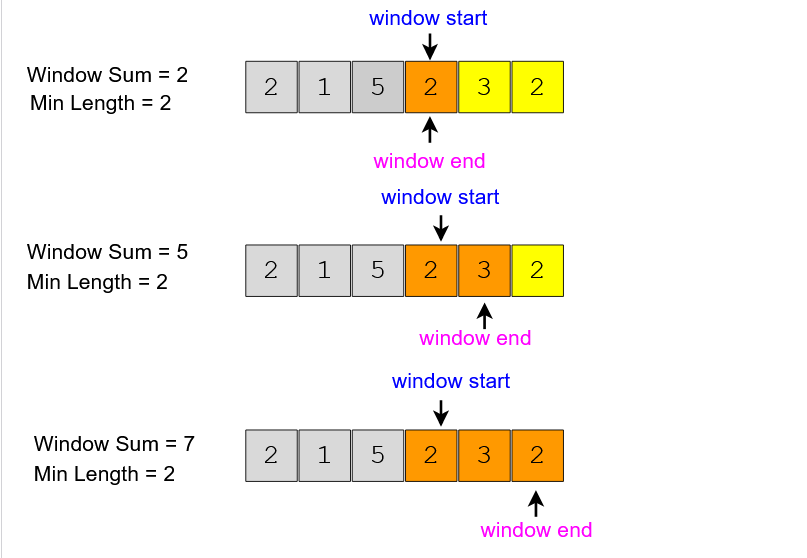
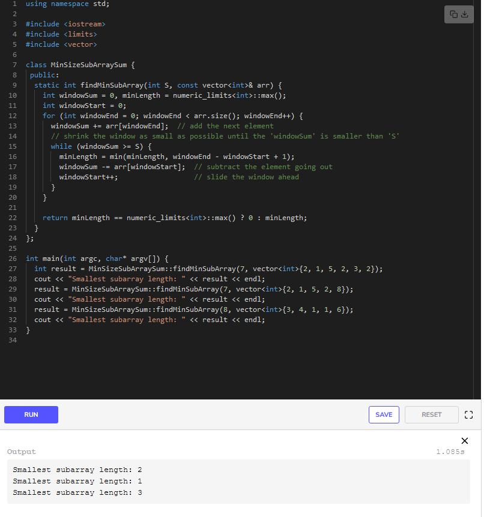

# Smallest Subarray with a given sum (easy)

## Problem Statement

Given an array of positive numbers and a positive number ‘S’, find the length of the smallest contiguous subarray whose sum is greater than or equal to ‘S’. Return 0, if no such subarray exists.

### Example 1:

Input: [2, 1, 5, 2, 3, 2], S=7 
Output: 2
Explanation: The smallest subarray with a sum great than or equal to '7' is [5, 2].

### Example 2:

Input: [2, 1, 5, 2, 8], S=7 
Output: 1
Explanation: The smallest subarray with a sum greater than or equal to '7' is [8].

### Example 3:

Input: [3, 4, 1, 1, 6], S=8 
Output: 3
Explanation: Smallest subarrays with a sum greater than or equal to '8' are [3, 4, 1] or [1, 1, 6].

## Solution

## Code

### Time Complexity 

The time complexity of the above algorithm will be O(N)O(N)O(N). The outer for loop runs for all elements and the inner while loop processes each element only once, therefore the time complexity of the algorithm will be O(N+N)O(N+N)O(N+N) which is asymptotically equivalent to O(N)O(N)O(N).

### Space Complexity

The algorithm runs in constant space O(1)O(1)O(1).
