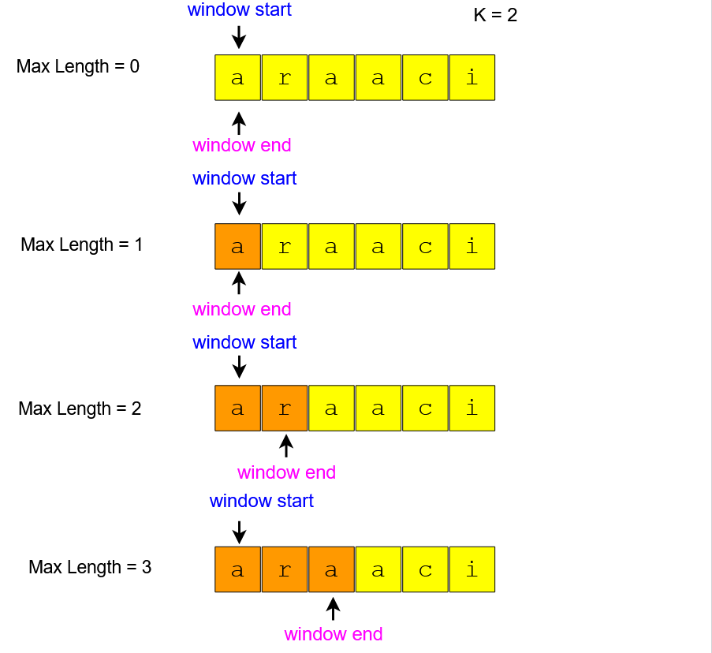
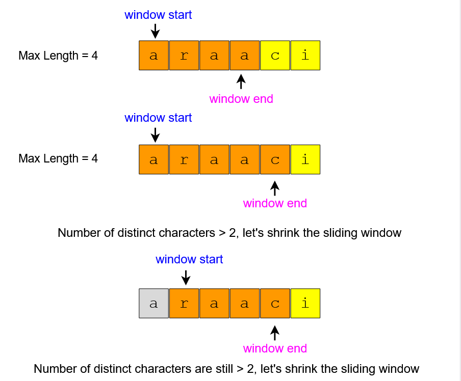
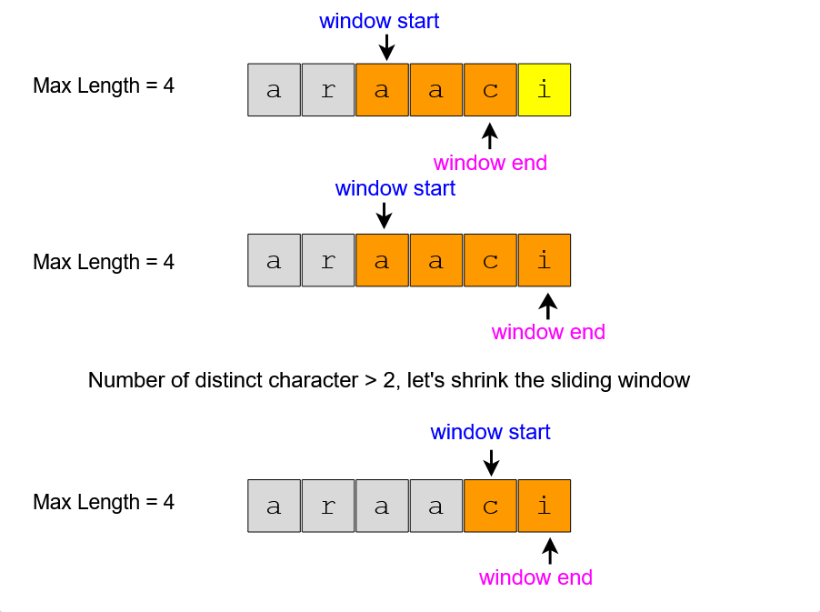
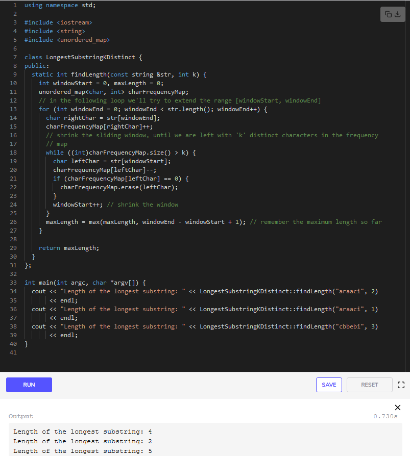

# Longest Substring with K Distinct Characters (medium)

## Problem Statement 

Given a string, find the length of the longest substring in it with no more than K distinct characters.

### Example 1:

Input: String="araaci", K=2
Output: 4
Explanation: The longest substring with no more than '2' distinct characters is "araa".

### Example 2:

Input: String="araaci", K=1
Output: 2
Explanation: The longest substring with no more than '1' distinct characters is "aa".

### Example 3:

Input: String="cbbebi", K=3
Output: 5
Explanation: The longest substrings with no more than '3' distinct characters are "cbbeb" & "bbebi".

## Solution

## Code

### Time Complexity

The time complexity of the above algorithm will be O(N)O(N)O(N) where ‘N’ is the number of characters in the input string. The outer for loop runs for all characters and the inner while loop processes each character only once, therefore the time complexity of the algorithm will be O(N+N)O(N+N)O(N+N) which is asymptotically equivalent to O(N)O(N)O(N).

### Space Complexity

The space complexity of the algorithm is O(K)O(K)O(K), as we will be storing a maximum of ‘K+1’ characters in the HashMap.
