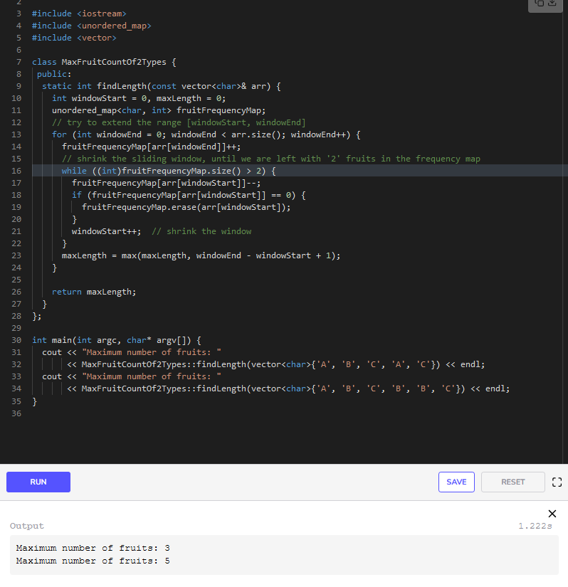

# Fruits into Baskets (medium)

## Problem Statement

Given an array of characters where each character represents a fruit tree, you are given two baskets and your goal is to put maximum number of fruits in each basket. The only restriction is that each basket can have only one type of fruit.

You can start with any tree, but once you have started you can’t skip a tree. You will pick one fruit from each tree until you cannot, i.e., you will stop when you have to pick from a third fruit type.

Write a function to return the maximum number of fruits in both the baskets.

### Example 1:

Input: Fruit=['A', 'B', 'C', 'A', 'C']
Output: 3
Explanation: We can put 2 'C' in one basket and one 'A' in the other from the subarray ['C', 'A', 'C']

### Example 2:

Input: Fruit=['A', 'B', 'C', 'B', 'B', 'C']
Output: 5
Explanation: We can put 3 'B' in one basket and two 'C' in the other basket. 
This can be done if we start with the second letter: ['B', 'C', 'B', 'B', 'C']

## Solution

This problem follows the Sliding Window pattern and is quite similar to Longest Substring with K Distinct Characters. In this problem, we need to find the length of the longest subarray with no more than two distinct characters (or fruit types!). This transforms the current problem into Longest Substring with K Distinct Characters where K=2.

## Code

### Time Complexity

The time complexity of the above algorithm will be O(N)O(N)O(N) where ‘N’ is the number of characters in the input array. The outer for loop runs for all characters and the inner while loop processes each character only once, therefore the time complexity of the algorithm will be O(N+N)O(N+N)O(N+N) which is asymptotically equivalent to O(N)O(N)O(N).

### Space Complexity

The algorithm runs in constant space O(1)O(1)O(1) as there can be a maximum of three types of fruits stored in the frequency map.

> ## Similar Problems

> Problem 1: Longest Substring with at most 2 distinct characters

> Given a string, find the length of the longest substring in it with at most two distinct characters.

> Solution: This problem is exactly similar to our parent problem