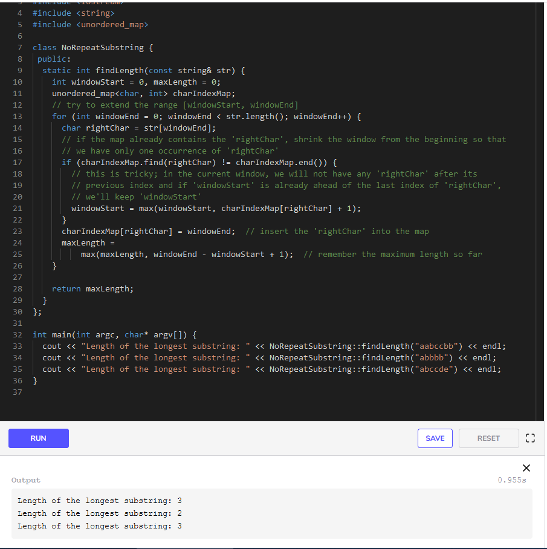

# No-repeat Substring (hard)

## Problem Statement

Given a string, find the length of the longest substring which has no repeating characters.

### Example 1:

Input: String="aabccbb"
Output: 3
Explanation: The longest substring without any repeating characters is "abc".

### Example 2:

Input: String="abbbb"
Output: 2
Explanation: The longest substring without any repeating characters is "ab".

### Example 3:

Input: String="abccde"
Output: 3
Explanation: Longest substrings without any repeating characters are "abc" & "cde".

## Solution

This problem follows the Sliding Window pattern and we can use a similar dynamic sliding window strategy as discussed in Longest Substring with K Distinct Characters. We can use a HashMap to remember the last index of each character we have processed. Whenever we get a repeating character we will shrink our sliding window to ensure that we always have distinct characters in the sliding window.

## Code
Here is what our algorithm will look like:

### Time Complexity

The time complexity of the above algorithm will be O(N)O(N)O(N) where ‘N’ is the number of characters in the input string.

### Space Complexity

The space complexity of the algorithm will be `O(K)O(K)O(K)` where KKK is the number of distinct characters in the input string. This also means K<=NK<=NK<=N, because in the worst case, the whole string might not have any repeating character so the entire string will be added to the HashMap. Having said that, since we can expect a fixed set of characters in the input string (e.g., 26 for English letters), we can say that the algorithm runs in fixed space `O(1)O(1)O(1)`; in this case, we can use a fixed-size array instead of the HashMap.

