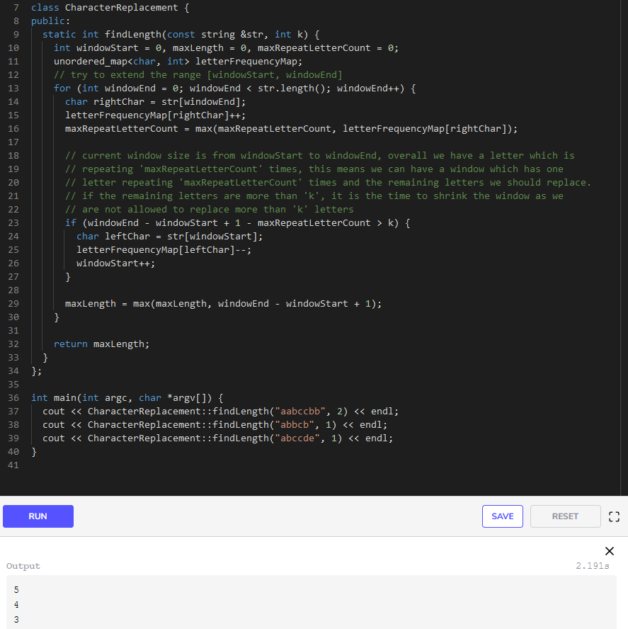

# Longest Substring with Same Letters after Replacement (hard)

## Problem Statement

Given a string with lowercase letters only, if you are allowed to replace no more than ‘k’ letters with any letter, find the length of the longest substring having the same letters after replacement.

### Example 1:

Input: String="aabccbb", k=2
Output: 5
Explanation: Replace the two 'c' with 'b' to have a longest repeating substring "bbbbb".

### Example 2:

Input: String="abbcb", k=1
Output: 4
Explanation: Replace the 'c' with 'b' to have a longest repeating substring "bbbb".

### Example 3:

Input: String="abccde", k=1
Output: 3
Explanation: Replace the 'b' or 'd' with 'c' to have the longest repeating substring "ccc".

## Solution

This problem follows the Sliding Window pattern and we can use a similar dynamic sliding window strategy as discussed in No-repeat Substring. We can use a HashMap to count the frequency of each letter.

We’ll iterate through the string to add one letter at a time in the window. We’ll also keep track of the count of the maximum repeating letter in any window (let’s call it maxRepeatLetterCount). So at any time, we know that we can have a window which has one letter repeating maxRepeatLetterCount times, this means we should try to replace the remaining letters. If we have more than ‘k’ remaining letters, we should shrink the window as we are not allowed to replace more than ‘k’ letters.

## Code

Here is what our algorithm will look like:

### Time Complexity

The time complexity of the above algorithm will be `O(N)O(N)O(N)` where ‘N’ is the number of letters in the input string.

### Space Complexity 

As we are expecting only the lower case letters in the input string, we can conclude that the space complexity will be O(26)O(26)O(26), to store each letter’s frequency in the HashMap, which is asymptotically equal to O(1)O(1)O(1).

