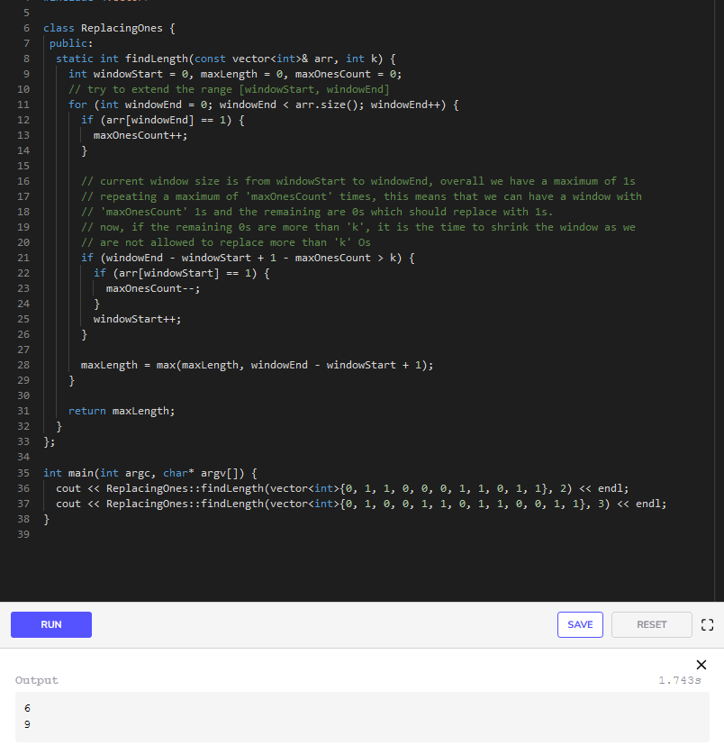

#Longest Subarray with Ones after Replacement (hard)

## Problem Statement 

Given an array containing 0s and 1s, if you are allowed to replace no more than ‘k’ 0s with 1s, find the length of the longest contiguous subarray having all 1s.

### Example 1:

Input: Array=[0, 1, 1, 0, 0, 0, 1, 1, 0, 1, 1], k=2
Output: 6
Explanation: Replace the '0' at index 5 and 8 to have the longest contiguous subarray of 1s having length 6.

### Example 2:

Input: Array=[0, 1, 0, 0, 1, 1, 0, 1, 1, 0, 0, 1, 1], k=3
Output: 9
Explanation: Replace the '0' at index 6, 9, and 10 to have the longest contiguous subarray of 1s having length 9.

## Solution

This problem follows the Sliding Window pattern and is quite similar to Longest Substring with same Letters after Replacement. The only difference is that, in the problem, we only have two characters (1s and 0s) in the input arrays.

Following a similar approach, we’ll iterate through the array to add one number at a time in the window. We’ll also keep track of the maximum number of repeating 1s in the current window (let’s call it maxOnesCount). So at any time, we know that we can have a window which has 1s repeating maxOnesCount time, so we should try to replace the remaining 0s. If we have more than ‘k’ remaining 0s, we should shrink the window as we are not allowed to replace more than ‘k’ 0s.

## Code

Here is how our algorithm will look like:

### Time Complexity

The time complexity of the above algorithm will be O(N)O(N)O(N) where ‘N’ is the count of numbers in the input array.

### Space Complexity #

The algorithm runs in constant space O(1)O(1)O(1).
