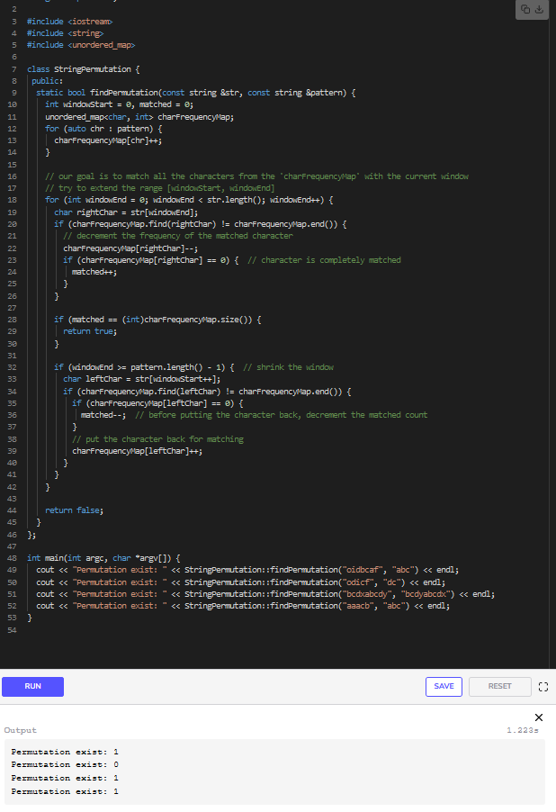

# Permutation in a String (hard)

Given a string and a pattern, find out if the string contains any permutation of the pattern.

Permutation is defined as the re-arranging of the characters of the string. For example, “abc” has the following six permutations:

    abc
    acb
    bac
    bca
    cab
    cba

If a string has ‘n’ distinct characters it will have n!n!n! permutations.

### Example 1:

Input: String="oidbcaf", Pattern="abc" 
Output: true 
Explanation: The string contains "bca" which is a permutation of the given pattern.

### Example 2:

Input: String="odicf", Pattern="dc" 
Output: false 
Explanation: No permutation of the pattern is present in the given string as a substring.

### Example 3:

Input: String="bcdxabcdy", Pattern="bcdyabcdx" 
Output: true 
Explanation: Both the string and the pattern are a permutation of each other.

### Example 4:

Input: String="aaacb", Pattern="abc" 
Output: true 
Explanation: The string contains "acb" which is a permutation of the given pattern.

## Solution

This problem follows the Sliding Window pattern and we can use a similar sliding window strategy as discussed in Longest Substring with K Distinct Characters. We can use a HashMap to remember the frequencies of all characters in the given pattern. Our goal will be to match all the characters from this HashMap with a sliding window in the given string. Here are the steps of our algorithm:

1. Create a HashMap to calculate the frequencies of all characters in the pattern.
2. Iterate through the string, adding one character at a time in the sliding window.
3. If the character being added matches a character in the HashMap, decrement its frequency in the map. If the character frequency becomes zero, we got a complete match.
4. If at any time, the number of characters matched is equal to the number of distinct characters in the pattern (i.e., total characters in the HashMap), we have gotten our required permutation.
5. If the window size is greater than the length of the pattern, shrink the window to make it equal to the size of the pattern. At the same time, if the character going out was part of the pattern, put it back in the frequency HashMap.

## Code

Here is what our algorithm will look like:

### Time Complexity

The time complexity of the above algorithm will be O(N+M)O(N + M)O(N+M) where ‘N’ and ‘M’ are the number of characters in the input string and the pattern respectively.

### Space Complexity 

The space complexity of the algorithm is O(M)O(M)O(M) since in the worst case, the whole pattern can have distinct characters which will go into the HashMap.

